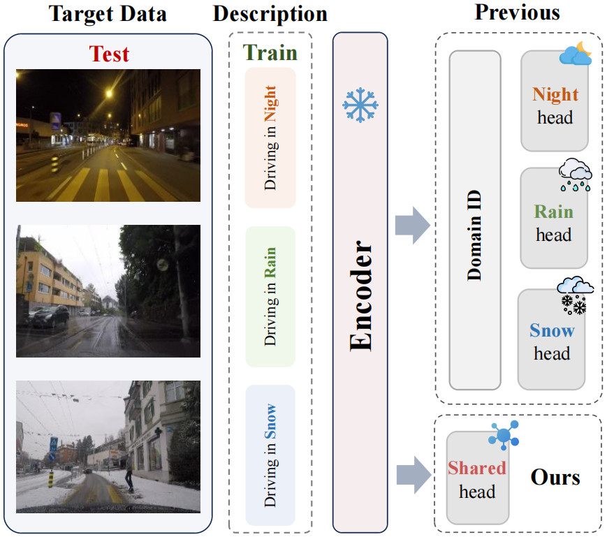

# Unified Language-driven Zero-shot Domain Adaptation (CVPR 2024)
[Senqiao Yang](https://scholar.google.com/citations?user=NcJc-RwAAAAJ&hl),
[Zhuotao Tian](https://scholar.google.com/citations?user=mEjhz-IAAAAJ&hl),
[Li Jiang](https://scholar.google.com/citations?user=5cIodxsAAAAJ&hl),
[Jiaya Jia](https://scholar.google.com/citations?user=XPAkzTEAAAAJ&hl=en)

[[`arXiv`](https://arxiv.org/abs/2404.07155)] [[`Page`](https://senqiaoyang.com/project/ulda)] [[`BibTeX`](#cite)]

<div align="center">
  
</div><br/>


## Video

<p align="center">
  <a href="https://www.youtube.com/watch?v=-9RiIbhcrew&ab_channel=SenqiaoYang">
    
  </a>
</p>
You can also see the performance comparison video on our project-page.

## Environment setup
```
conda env create -f environment.yml
conda activate ulda
```

## Prepare Dataset
* **CITYSCAPES**: Follow the instructions in [Cityscapes](https://www.cityscapes-dataset.com/)
  to download the images and semantic segmentation ground-truths. Please follow the dataset directory structure:
  ```html
  <CITYSCAPES_DIR>/             % Cityscapes dataset root
  ├── leftImg8bit/              % input image (leftImg8bit_trainvaltest.zip)
  └── gtFine/                   % semantic segmentation labels (gtFine_trainvaltest.zip)
  ```

* **ACDC**: Download ACDC images and ground truths from [ACDC](https://acdc.vision.ee.ethz.ch/download). Please follow the dataset directory structure:
  ```html
  <ACDC_DIR>/                   % ACDC dataset root
  ├── rbg_anon/                 % input image (rgb_anon_trainvaltest.zip)
  └── gt/                       % semantic segmentation labels (gt_trainval.zip)
  ```
 
* **GTA5**: Download GTA5 images and ground truths from [GTA5](https://download.visinf.tu-darmstadt.de/data/from_games/). Please follow the dataset directory structure:
  ```html
  <GTA5_DIR>/                   % GTA5 dataset root
  ├── images/                   % input image 
  └── labels/                   % semantic segmentation labels
  ```
## Prepare checkpoint
Our checkpoints are downloaded from [PODA](https://github.com/astra-vision/PODA)
 
You can directly download it from [here](https://drive.google.com/drive/folders/15-NhVItiVbplg_If3HJibokJssu1NoxL?usp=sharing).


## Run
### Stage 1 
Train the PIN to simulate the feature
```
bash bash/stage1.sh
```
### Stage 2
Rectify and train the unified decoder (with evaluation)
```
bash bash/stage2.sh
```
## Result
Due to the method's insensitivity to parameters, we randomly selected two sets of example parameters. Additionally, to maintain efficiency, we sampled **only 100 images to train the PIN**, which still achieved good performance. We encourage users to select parameters that best fit their specific tasks when utilizing our work.

The simulated PIN and adapted model can be downloaded from [here](https://drive.google.com/drive/folders/1bkNZ0n7kmM5Ct3QqHpv28wd3mFQfRAk1?usp=sharing).


| Domain | Fog  | Night | Rain  | Snow  | Average  |
|--------|------|-------|-------|-------|-------|
| mIoU   | 53.31 | 24.94 | 43.59 | 44.79 | 41.66

## Test
```
python predict.py --ckpt <your path>
```


## <a name="cite"></a>Citation
Please cite our work if you find it useful.
```bibtex
@inproceedings{yang2024unified,
  title={Unified Language-driven Zero-shot Domain Adaptation},
  author={Yang, Senqiao and Tian, Zhuotao and Jiang, Li and Jia, Jiaya},
  booktitle={Proceedings of the IEEE/CVF Conference on Computer Vision and Pattern Recognition},
  pages={23407--23415},
  year={2024}
}
```


